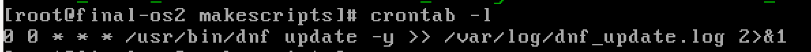
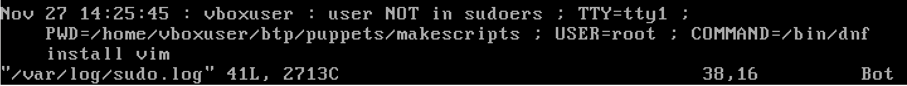
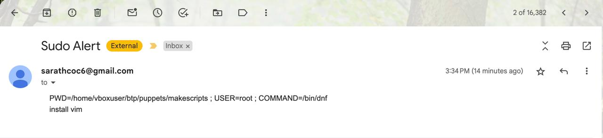
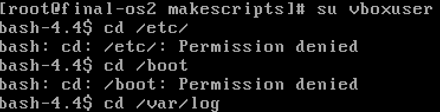
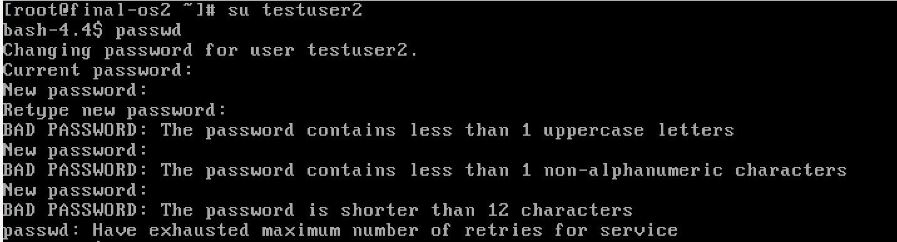
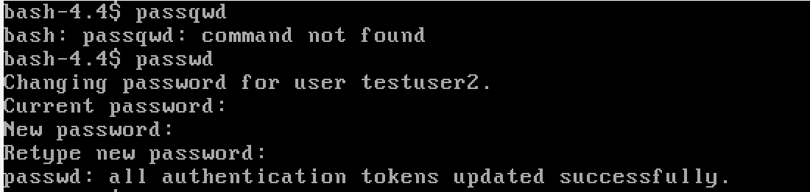
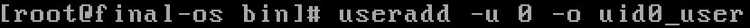
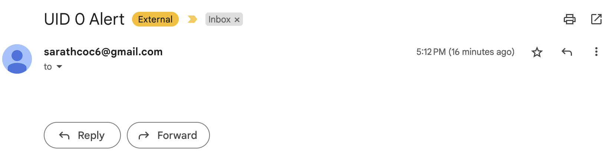

# Testing

## Instructions
- Please [download](https://yum.oracle.com/ISOS/OracleLinux/OL8/u10/x86_64/OracleLinux-R8-U10-x86_64-dvd.iso) Oracle Linux 8.1 iso image. 

- Please download a virtual machine, preferably [VirtualBox](https://www.oracle.com/virtualization/technologies/vm/downloads/virtualbox-downloads.html), since VirtualBox and OracleLinux are released by Oracle. 

- Start a VM instance. 

- install essential commands like `git` and `sudo` using `dmg` package manager

- Please clone this repository and navigate to installation scripts folder
    ```bash
    git clone https://github.com/Amithabh-A/puppets
    cd puppets/makescripts
    ```

- Run installation script
    ```bash
    ./run_all.sh
    ```

## Verification of important hardening parameters

- Please create a user for testing purposes. 
    ```bash
    useradd testuser
    passwd testuser
    ```
    please type out password. 

- To switch to this user, please use `su` command. 
    ```bash
    su testuser
    ```
- If you want to come back to root user, either use `su` command or execute `exit` command(if you have `su` ed to current user from root user)


###  [Keep all packages and kernel up to date](README.md#keep-all-packages-and-kernel-up-to-date)

- Check whether the cron job is enabled

    ```bash
    crontab -l
    ```
    
  
    This image shows that `dnf update -y` is set up as a cron job that is scheduled to run at 00 mins, 00hrs, every day in a month, every month in a year and every day in a week. 
    Its output is logged to `var/log/dnf_update.log`. 

### [Log sudo](README.md#log-sudo)

- Run a sudo command from terminal, and check `/var/log/sudo.log` for entry

    
  
    This image shows the log of a sudo execution done by a user who don't have sudo permissions. 

- PS: You need sudo permissions to access `var/log/sudo.log` (if you are trying to access that file from a user created by yourself)


### [Notify SystemAdmin via mail whenever sudo is used by someone](README.md#notify-systemadmin-via-mail-whenever-sudo-is-used-by-someone)

- When sudo is executed, the system admin will be emailed. 

    
  
    This is the mail received by admin from the system when root user ran `sudo dnf install vim` 
    
- System email was set to [Sarath's mail](mailto:sarathcoc6@gmail.com) and Admin email was set to [Amithabh's mail](mailto:12101004@smail.iitpkd.ac.in) while testing. 

### [Use setfacl to restrict access to portions of the file system](README.md#use-setfacl-to-restrict-access-to-portions-of-the-file-system)

- Currently, non-root users cannot access these [directories](./makescripts/restricted_directories.txt). 

    
  
    This is the image of non-root user trying to access restricted directories

### [Enforcing password conditions](README.md#enforcing-password-conditions)

- Test the password enforcement by setting a new password for a user. Test out by giving some non-safe passwords, and see it rejecting the password with the reason. 

    
  
    Above image shows all failed attempts in setting the password

    
  
    Above image shows successful attempt in setting the password

### [Validate UID of non-root users](README.md#validate-uid-of-non-root-users)

- For testing, a user is created with uid 0
    
  
    
